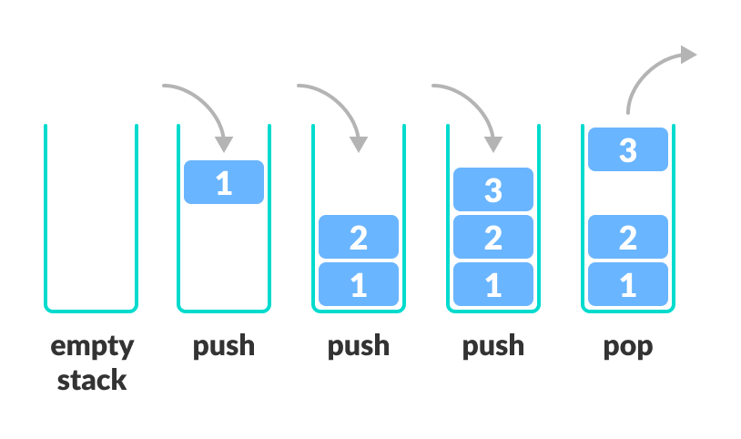

[Leia esta página em português](./README.md)

# Stacks

**Table of Contents**

- [Stacks](#stacks)
  - [Introduction](#introduction)
  - [Methods](#methods)
  - [Applications](#applications)
  - [Complexity Analysis](#complexity-analysis)

## Introduction

A stack is an ordered collection of items that follows the Last In First Out (LIFO) principle. Its fundamental idea is that all access to its elements is done from the top. Thus, when a new element is introduced into the stack, it becomes the top element. The only element that can be removed from the stack is the one at the top.

To understand how a stack structure works, we can make an analogy with a stack of plates. To take a plate from the stack, we remove the one from the top. Hence, we must remove the top plate to access the next one. The stack structure works similarly, where adding new items or removing existing items occurs at the same end.

> A stack is also used by compilers in programming languages, by computer memory to store variables and method calls, and also by the browser's history.

## Methods

It has the following fundamental operations:

- Push: Adds an element to the top of the stack.
- Pop: Removes the element from the top of the stack.
- Peek (Top): Retrieves the element at the top of the stack without removing it.
- isEmpty: Checks if the stack is empty.
- Size: Returns the number of elements in the stack.
- Clear: Removes all elements from the stack, leaving it empty.

## Applications

- Function call management (Call Stack).
- History navigation.
- Mathematical expression evaluation.
- Memory management.
- Solving recursive problems.

## Complexity Analysis

The operation of inserting and removing in the stack always performs basic operations. Therefore, these are constant-time operations and take O(1) time.

However,inspecting the entire stack traverses all the elements stored in it. Considering that a stack contains *n* elements, the execution time will be O(n).

The operation of emptying the stack involves removing all its elements. The time spent on this operation depends on the programming language being used.
