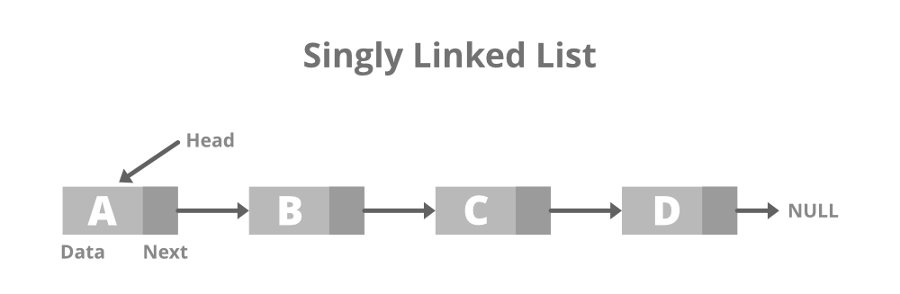
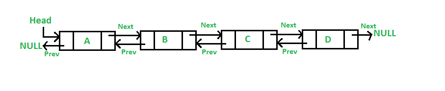
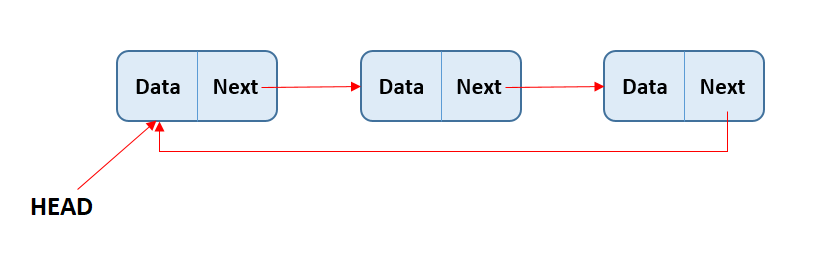
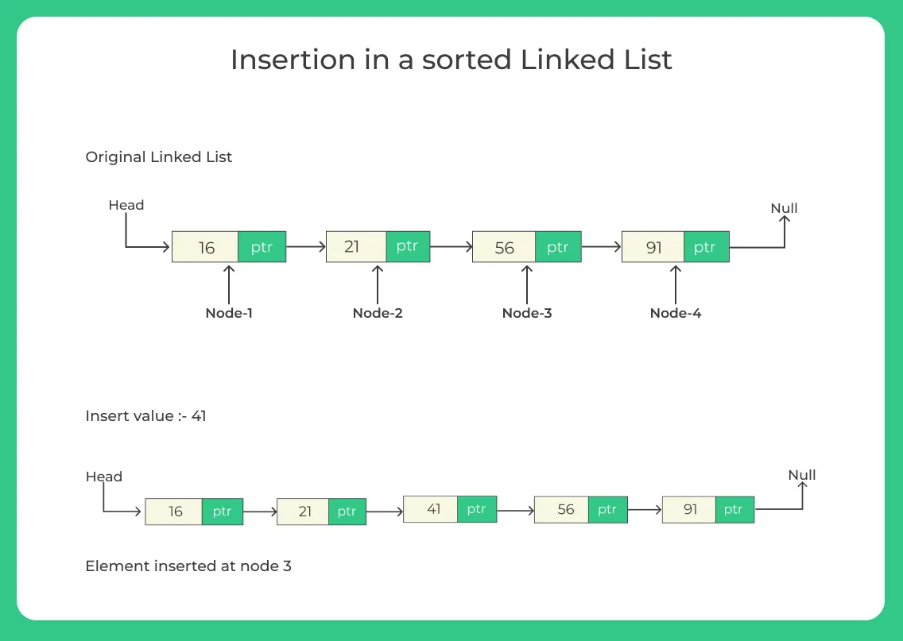

[Read this page in English](./README.md)

**Sumário**

- [Lista Encadeada](#lista-encadeada)
  - [Introdução](#introdução)
  - [Métodos](#métodos)
  - [Aplicações](#aplicações)
- [Lista Duplamente Encadeada](#lista-duplamente-encadeada)
  - [Introdução](#introdução-1)
  - [Métodos](#métodos-1)
  - [Aplicações](#aplicações-1)
- [Lista Encadeada Circular](#lista-encadeada-circular)
  - [Introdução](#introdução-2)
  - [Métodos](#métodos-2)
  - [Aplicações](#aplicações-2)
- [Lista Encadeada Ordenada](#lista-encadeada-ordenada)
  - [Introdução](#introdução-3)
  - [Métodos](#métodos-3)
  - [Aplicações](#aplicações-3)

# Lista Encadeada

## Introdução

As listas ligadas armazenam uma coleção sequencial de elementos; no entanto, de modo diferente dos arrays, não podemos garantir que os elementos armazenados na lista ocuparão um espaço de memória contínuo; portanto, não temos acesso direto aos elementos da lista.
Para manter a lista encadeada devemos armazenar, junto com a informação do elemento, um ponteiro para o próximo elemento da lista.

Uma das vantagens de uma lista encadeada em relação a um array convencional é que não é necessário deslocar os elementos quando eles são adicionados ou removidos. Entretanto, precisamos usar ponteiros quando trabalhamos com uma lista encadeada, e, por esse motivo, é preciso prestar atenção especial na implementação desse tipo de lista.

Temos um exemplo de lista encadeada no mundo real, que talvez seja o mais popularmente usado para exemplificar as listas ligadas: um trem. Um trem é constituído de uma série de carros (também conhecidos como vagões). Cada um dos carros ou vagões está ligado a outro. Você pode facilmente desconectar um vagão, mudá-lo de lugar, ou ainda adicionar ou remover um vagão

> É muito importante ter variáveis que referenciem os nós a serem controlados para que a ligação entre eles não seja perdida. Poderíamos trabalhar com apenas uma variável (previous), mas seria mais difícil controlar as ligações entre os nós. Por esse motivo, é melhor declarar uma variável extra para nos ajudar com essas referências.

## Métodos

- push: adiciona um elemento ao final da lista
- insert: Insere um elemento em uma posição específica da lista.
- getElementAt: Devolve o elemento que está em uma posição específica da lista.
- remove: Remove um elemento da lista.
- indexOf: Devolve o índice do elemento na lista.
- removeAt: Remove um item de uma posição específica da lista.
- isEmpty: Verifica se a lista está vazia.
- size: Retorna a quantidade de elementos na fila.
- Clear: Remove todos os elementos da fila, deixando-a vazia.

## Aplicações

- Implementação de Algoritmos.
- Aplicações Gráficas.
- Solução de Problemas Recursivos.

# Lista Duplamente Encadeada

## Introdução

A estrutura de lista encadeada caracteriza-se por formar um encadeamento simples entre os elementos: cada elemento armazena um ponteiro para o próximo elemento da lista. Dessa forma, não temos como percorrer eficientemente os elementos em ordem inversa. O encadeamento simples também dificulta a retirada de uma elemento da lista. Mesmo se tivermos o ponteiro do elemento, para encontrar o elemento anterior, pois, dado o ponteiro para um determinado elemento, não temos como acessar diretamente seu elemento anterior.

Para solucionar esses problemas, podemos formar uma lista duplamente encadeada. Cada elemento dessa lista tem um ponteiro para o próximo elemento e um ponteiro para o elemento anterior. Se tivermos um ponteiro para o último elemento da lista, podemos percorrer a lista em ordem inversa, bastando acessar continuamente o elemento anterior até alcançar o primeiro elemento da lista.

> A diferença entre uma lista duplamente encadeada e uma lista encadeada comum é que, nessa última, fazemos a ligação somente de um nó para o próximo, enquanto, em uma lista duplamente encadeada, temos uma ligação dupla: uma para o próximo elemento e outra para o elemento anterior.

## Métodos

- push: adiciona um elemento ao final da lista
- insert: Insere um elemento em uma posição específica da lista.
- getElementAt: Devolve o elemento que está em uma posição específica da lista.
- remove: Remove um elemento da lista.
- indexOf: Devolve o índice do elemento na lista.
- removeAta: Remove um item de uma posição específica da lista.
- isEmpty: Verifica se a lista está vazia.
- size: Retorna a quantidade de elementos na fila.
- Clear: Remove todos os elementos da fila, deixando-a vazia.

## Aplicações

- Lista de reprodução em Players de Música/Vídeo.
- Sistemas de Gerenciamento de Tarefas.
- Gerenciamento de Undo/Redo em Editores.

# Lista Encadeada Circular

## Introdução

Uma lista encadeada circular pode ter apenas uma direção de referência (como na lista encadeada) ou uma referência dupla (como na lista duplamente encadeada). A única diferença entre uma lista encadeada circular e uma lista encadeada é que o ponteiro para o próximo item do último elemento não faz uma referência a undefined, mas ao primeiro elemento da lista.

## Métodos

- push: adiciona um elemento ao final da lista
- insert: Insere um elemento em uma posição específica da lista.
- getElementAt: Devolve o elemento que está em uma posição específica da lista.
- remove: Remove um elemento da lista.
- indexOf: Devolve o índice do elemento na lista.
- removeAta: Remove um item de uma posição específica da lista.
- isEmpty: Verifica se a lista está vazia.
- size: Retorna a quantidade de elementos na fila.
- Clear: Remove todos os elementos da fila, deixando-a vazia.

## Aplicações

- Algoritmos de Escalonamento Circular.
- Simulações e Jogos.
- Listas de Reprodução Circular.

# Lista Encadeada Ordenada

## Introdução

Uma lista encadeada ordenada é uma lista que mantém seus elementos ordenados. Para manter todos os elementos ordenados, em vez de aplicar um algoritmo de ordenação, inseriremos o elemento em sua posição correta a fim de manter a lista sempre ordenada.

## Métodos

- push: adiciona um elemento ao final da lista
- insert: Insere um elemento em uma posição específica da lista.
- getElementAt: Devolve o elemento que está em uma posição específica da lista.
- remove: Remove um elemento da lista.
- indexOf: Devolve o índice do elemento na lista.
- removeAta: Remove um item de uma posição específica da lista.
- isEmpty: Verifica se a lista está vazia.
- size: Retorna a quantidade de elementos na fila.
- Clear: Remove todos os elementos da fila, deixando-a vazia.

## Aplicações

- Gerenciamento de Memória em Sistemas Embarcados.
- Aplicações de Processamento de Eventos.
- Implementação de Algoritmos de Ordenação.
