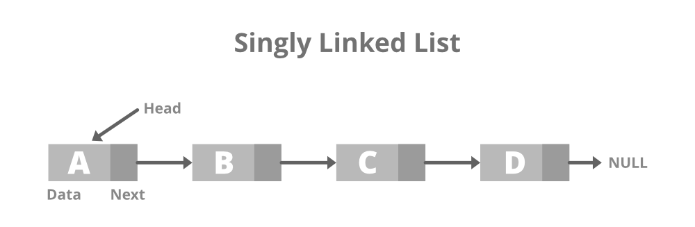

[Leia esta página em português](./README-pt.md)

**Summary**

- [Linked List](#linked-list)
  - [Introduction](#introduction)
  - [Methods](#methods)
  - [Applications](#applications)
- [Doubly Linked List](#doubly-linked-list)
  - [Introduction](#introduction-1)
  - [Methods](#methods-1)
  - [Applications](#applications-1)
- [Circular Linked List](#circular-linked-list)
  - [Introduction](#introduction-2)
  - [Methods](#methods-2)
  - [Applications](#applications-2)
- [Sorted Linked List](#sorted-linked-list)
  - [Introduction](#introduction-3)
  - [Methods](#methods-3)
  - [Applications](#applications-3)

# Linked List

## Introduction

Linked lists store a sequential collection of elements; however, unlike arrays, we cannot guarantee that the elements stored in the list will occupy a continuous memory space; thus, we don't have direct access to the elements of the list. To maintain the linked list, we must store, along with the element's information, a pointer to the next element in the list.

One advantage of a linked list over a conventional array is that there's no need to shift elements when they are added or removed. However, using pointers is necessary when working with a linked list, requiring special attention in implementing this type of list.

A real-world example of a linked list, perhaps most commonly used to illustrate linked lists, is a train. A train consists of a series of cars (also known as wagons). Each of these cars or wagons is linked to another. You can easily disconnect a wagon, move it around, or add/remove a wagon.

> It's crucial to have variables that reference the nodes to be controlled to avoid losing connections between them. We could work with just one variable (previous), but it would be more challenging to manage the links between the nodes. Therefore, it's better to declare an extra variable to help with these references.

## Methods

- push: adds an element to the end of the list
- insert: Inserts an element at a specific position in the list.
- getElementAt: Returns the element at a specific position in the list.
- remove: Removes an element from the list.
- indexOf: Returns the index of the element in the list.
- removeAt: Removes an item from a specific position in the list.
- isEmpty: Checks if the list is empty.
- size: Returns the number of elements in the list.
- Clear: Removes all elements from the list, leaving it empty.

## Applications

- Algorithm Implementation.
- Graphic Applications.
- Recursive Problem Solving.

# Doubly Linked List

## Introduction

The structure of a linked list is characterized by forming a simple linkage between elements: each element stores a pointer to the next element in the list. Consequently, efficiently traversing elements in reverse order is not feasible. The single linkage also complicates removing an element from the list, even if we have the pointer of the element, as given the pointer to a particular element, we cannot directly access its previous element.

To address these issues, we can form a doubly linked list. Each element in this list has a pointer to the next element and a pointer to the previous element. If we have a pointer to the last element in the list, we can traverse the list in reverse order by continuously accessing the previous element until reaching the first element of the list.

> The difference between a doubly linked list and a common linked list is that in the latter, we establish a linkage only from one node to the next, whereas in a doubly linked list, we have a dual linkage: one for the next element and another for the previous element.

## Methods

- push: adds an element to the end of the list
- insert: Inserts an element at a specific position in the list.
- getElementAt: Returns the element at a specific position in the list.
- remove: Removes an element from the list.
- indexOf: Returns the index of the element in the list.
- removeAt: Removes an item from a specific position in the list.
- isEmpty: Checks if the list is empty.
- size: Returns the number of elements in the list.
- Clear: Removes all elements from the list, leaving it empty.

## Applications

- Playlist in Music/Video Players.
- Task Management Systems.
- Undo/Redo Management in Editors.

# Circular Linked List

## Introduction

A circular linked list can have either a single reference direction (as in the linked list) or a double reference (as in the doubly linked list). The only difference between a circular linked list and a linked list is that the pointer to the next item of the last element does not reference undefined but instead points to the first element of the list.

## Methods

- push: adds an element to the end of the list
- insert: Inserts an element at a specific position in the list.
- getElementAt: Returns the element at a specific position in the list.
- remove: Removes an element from the list.
- indexOf: Returns the index of the element in the list.
- removeAt: Removes an item from a specific position in the list.
- isEmpty: Checks if the list is empty.
- size: Returns the number of elements in the list.
- Clear: Removes all elements from the list, leaving it empty.

## Applications

- Circular Scheduling Algorithms.
- Simulations and Games.
- Circular Playlists.

# Sorted Linked List

## Introduction

A sorted linked list is a list that keeps its elements sorted. To maintain all elements sorted, instead of applying a sorting algorithm, we insert the element in its correct position to keep the list always ordered.

## Methods

- push: adds an element to the end of the list
- insert: Inserts an element at a specific position in the list.
- getElementAt: Returns the element at a specific position in the list.
- remove: Removes an element from the list.
- indexOf: Returns the index of the element in the list.
- removeAt: Removes an item from a specific position in the list.
- isEmpty: Checks if the list is empty.
- size: Returns the number of elements in the list.
- Clear: Removes all elements from the list, leaving it empty.

## Applications

- Memory Management in Embedded Systems.
- Event Processing Applications.
- Implementation of Sorting Algorithms.
